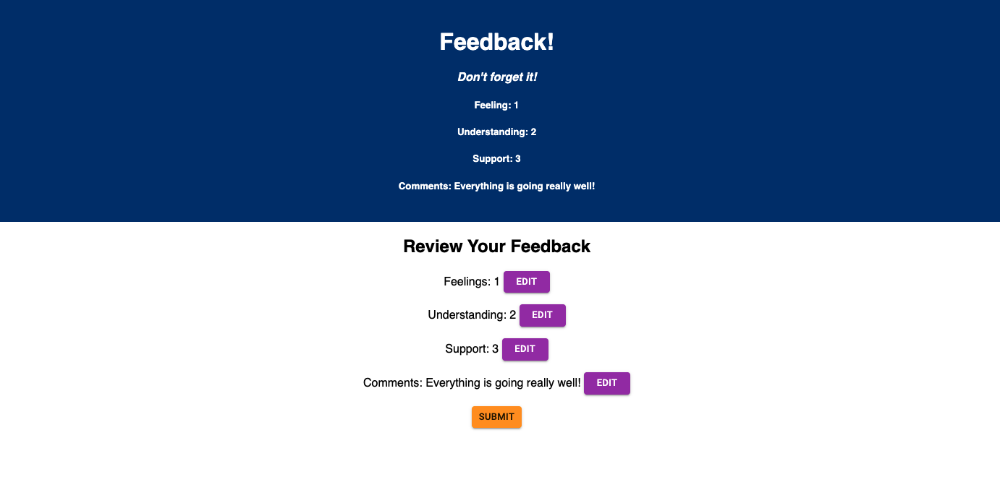
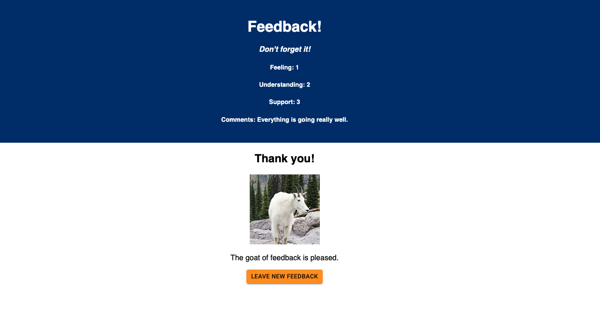
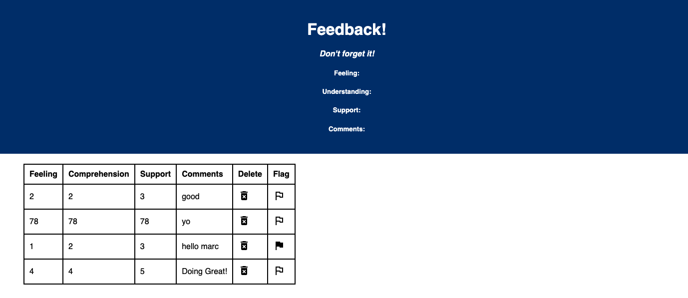

# Redux Feedback Form

## Description
_Duration: 1 weekend sprint_

For this Full Stack project I created a form application to gather user feedback. Before the user submits any feedback, they can go back and edit their answers. User inputs are stored using Redux before being sent sever-side. Going to /admin in the URL shows a table displaying all of the responses from the database where the user can flag responses and delete responses.

The application is [deployed to Heroku](https://tranquil-woodland-72204.herokuapp.com/#/). 

## Interface

##

##

##

## Installation

([Node.js](https://nodejs.org/en/) is used in this project)

To locally run the project...

1. Create a database named `prime_feedback`,
2. The queries in the `data.sql` file are set up to create all the necessary tables and populate those tables with some sample feedack. The project is built on [Postgres](https://www.postgresql.org/download/), so you will need to make sure to have that installed. Using Postico is recommended to run those queries as that was used to create the queries 
3. Open up your code editor of choice and run `npm install` in your terminal to install the necessary dependencies
4. Run `npm run server` in your terminal to start up the server
5. Run `npm run client` in your terminal to start up the client in your browser
6. The `npm run client` command will open up a new browser tab for you! (if not there will be a localhost link in your termainl you can use)

## Built with...

- React
- Redux
- Redux-Saga
- Express
- Node.js
- PostgreSQL
- PG
- Heroku

## Acknowledgement

Thanks to [Prime Digital Academy](www.primeacademy.io)!
